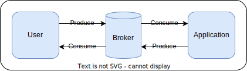
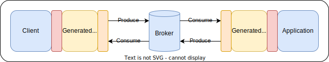

# AsyncAPI Codegen

Generate Go application and user boilerplate from AsyncAPI specifications.

**⚠️ Do not hesitate raise an issue on any bug or missing feature.**
**Contributions are welcomed!**

*Inspired from popular [deepmap/oapi-codegen](https://github.com/deepmap/oapi-codegen)*

## Contents

* [Supported functionalities](#supported-functionalities)
* [Usage](#usage)
* [Concepts](#concepts)
* [Examples](#examples)
  * [Basic example](#basic-example)
  * [Request/Response example](#requestresponse-example)
* [Supported Brokers](#supported-brokers)
  * [Kafka](#kafka)
  * [NATS](#nats)
  * [Custom broker](#custom-broker)
* [CLI options](#cli-options)
* [Advanced topics](#advanced-topics)
  * [Middlewares](#middlewares)
  * [Context](#context)
  * [Logging](#logging)
  * [Versioning](#versioning)
  * [AsyncAPI Extensions](#asyncapi-extensions)
* [Contributing and support](#contributing-and-support)

## Supported functionalities

* AsyncAPI versions:
  * 2.6.0
* Brokers:
  * Kafka
  * NATS
  * Custom
* Formats:
  * JSON
* Logging:
  * Elastic Common Schema (JSON)
  * Text (Humand readable)
  * Custom
* Others:
  * Versioning support

## Usage

In order to use this library in your code, please execute the following lines:

```shell
# Install the tool
go install github.com/lerenn/asyncapi-codegen/cmd/asyncapi-codegen@latest

# Generate the code from the asyncapi file
asyncapi-codegen -i ./asyncapi.yaml -p <your-package> -o ./asyncapi.gen.go

# Install dependencies needed by the generated code
go get -u github.com/lerenn/asyncapi-codegen/pkg/extensions
```

You can also specify the generation part by adding a `go generate` instruction
at the beginning of your file:

```golang
//go:generate go run github.com/lerenn/asyncapi-codegen/cmd/asyncapi-codegen@<version> -i ./asyncapi.yaml -p <your-package> -o ./asyncapi.gen.go
```

## Concepts



Let's imagine a message broker centric architecture: you have the application
that you are developing on the right and the potential user(s) on the left.

Being a two directional communication, both of them can communicate to each
other through the broker. They can even communicate with themselves, in case
of multiple users or application replication.

For more information about this, please refere to the [official AsyncAPI
concepts](https://www.asyncapi.com/docs/concepts).

### With Async API generated code



* <span style="color:yellow">Yellow parts</span>: when using the codegen tool,
you will generate the code that will act as an adapter (called **controller**)
between the user, the broker, and the application.
* <span style="color:red">Red parts</span>: you will need to fill these parts
between user, broker and application. These will allow message production and
reception with the generated code.
* <span style="color:orange">Orange parts</span>: these parts will be available
in this repository if you use an already supported broker. However, you can also
use the implement it yourself if the broker is not supported yet.

## Examples

Here is a list of example, from basic to advanced ones.

### Basic example

This example will use the AsyncAPI official example of the
[HelloWorld](https://www.asyncapi.com/docs/tutorials/getting-started/hello-world).

> The code for this example have already been generated and can be
[read here](./examples/helloworld/nats), in the subdirectories `app/`
and `user/`. You can execute the example with `make run`.

In order to recreate the code for user and application, you have to run this command:

```shell
# Install the tool
go install github.com/lerenn/asyncapi-codegen/cmd/asyncapi-codegen@latest

# Generate the code from the asyncapi file
asyncapi-codegen -i examples/helloworld/asyncapi.yaml -p main -o ./helloworld.gen.go
```

We can then go through the `helloworld.gen.go` file to understand what will be used.

#### Application

Here is the code that is generated for the application side, with corresponding
comments:

```go
// AppController is the struct that you will need in order to interact with the
// event broker from the application side. You will generate this with the
// NewAppController function below.
type AppController struct

// NewAppController will create a new App Controller and will connect the
// BrokerController that you pass in argument to subscription and publication method.
func NewAppController(bs BrokerController, options ...ControllerOption) *AppController

// Close function will clean up all resources and subscriptions left in the
// application controller. This should be call right after NewAppController
// with a `defer`
func (ac *AppController) Close(ctx context.Context)

// SubscribeAll will subscribe to all channel that the application should listen to.
//
// In order to use it, you'll have to implement the AppSubscriber interface and
// pass it as an argument to this function. Thus, the subscription will automatically
// call the corresponding function when it will receive a message.
//
// In the HelloWorld example, only one function will listen on application side,
// making it a bit overkill. You can directly use the SubscribeHello method.
func (ac *AppController) SubscribeAll(ctx context.Context, as AppSubscriber) error

// UnsubscribeAll will unsubscribe all channel that have subscribed to through
// SubscribeAll or SubscribeXXX where XXX correspond to the channel name.
func (ac *AppController) UnsubscribeAll(ctx context.Context)

// SubscribeHello will subscribe to new messages on the "hello" channel.
// It will expect messages as specified in the AsyncAPI specification.
//
// You just have to give a function that match the signature of the callback and
// then process the received message.
//
// The `done` argument is true when the subscription is closed. It can be used to
// cleanup resources, such as channels.
//
// The subscription will be canceled if the context is canceled, if the subscription
// is explicitely unsubscribed or if the controller is closed
func (ac *AppController) SubscribeHello(ctx context.Context, fn func(msg HelloMessage)) error

// UnsubscribeHello will unsubscribe only the subscription on the "hello" channel.
// It should be only used when wanting specifically that, otherwise the clean up
// will be handled by the Close function.
func (ac *AppController) UnsubscribeHello(ctx context.Context)
```

And here is an example of the application that could be written to use this generated
code with NATS (you can also find it [here](./examples/helloworld/nats/app/main.go)):

```go
import(
  "github.com/lerenn/asyncapi-codegen/pkg/extensions/brokers/nats"
  // ...
)

func main() {
  // Create a NATS controller
  broker := nats.NewController("nats://nats:4222")
  defer broker.Close()

  // Create a new application controller
  ctrl, _ := NewAppController(broker)
  defer ctrl.Close(context.Background())

  // Subscribe to HelloWorld messages
  // Note: it will indefinitely wait for messages as context has no timeout
  log.Println("Subscribe to hello world...")
  ctrl.SubscribeHello(context.Background(), func(_ context.Context, msg HelloMessage) {
    log.Println("Received message:", msg.Payload)
  })

  // Process messages until interruption signal
  // ...
}
```

#### User

Here is the code that is generated for the user side, with corresponding
comments:

```go
// UserController is the struct that you will need in order to interact with the
// event broker from the user side. You will generate this with the
// NewUserController function below.
type UserController struct

// NewUserController will create a new User Controller and will connect the
// BrokerController that you pass in argument to subscription and publication method.
func NewUserController(bs BrokerController, options ...ControllerOption) *UserController

// Close function will clean up all resources and subscriptions left in the
// application controller. This should be call right after NewAppController
// with a `defer`
func (cc *UserController) Close(ctx context.Context)

// PublishHello will publish a hello world message on the "hello" channel as
// specified in the AsyncAPI specification.
func (cc *UserController) PublishHello(ctx context.Context, msg HelloMessage) error
```

And here is an example of the user that could be written to use this generated
code with NATS (you can also find it [here](./examples/helloworld/nats/app/main.go)):

```go
import(
  "github.com/lerenn/asyncapi-codegen/pkg/extensions/brokers/nats"
  // ...
)

func main() {
  // Create a NATS controller
  broker := nats.NewController("nats://nats:4222")
  defer broker.Close()

  // Create a new user controller
  ctrl, _ := NewUserController(broker)
  defer ctrl.Close(context.Background())

  // Send HelloWorld
  log.Println("Publishing 'hello world' message")
  ctrl.PublishHello(context.Background(), HelloMessage{Payload: "HelloWorld!"})

  // ...
}
```

#### Types

According to the specification that you pass in parameter, some types will also
be  Here is the ones generated for the HelloWorld example:

```go
// HelloMessage will contain all the information that will be sent on the 'hello'
// channel. There is only a payload here, but you could find also headers,
// correlation id, and more.
type HelloMessage struct {
  Payload string
}
```

### Request/Response example

This example will use a `ping` example that you can find
[here](./examples/ping/asyncapi.yaml).

> The code for this example have already been generated and can be
[read here](./examples/ping/nats), in the subdirectories `app/`
and `user/`. You can execute the example with `make run`.

In order to recreate the code for user and application, you have to run this command:

```shell
# Install the tool
go install github.com/lerenn/asyncapi-codegen/cmd/asyncapi-codegen@latest

# Generate the code from the asyncapi file
asyncapi-codegen -i examples/ping/asyncapi.yaml -p main -o ./ping.gen.go
```

We can then go through the possible application and user implementations that
use `ping.gen.go`.

#### Application

```golang
type Subscriber struct {
  Controller *AppController
}

func (s Subscriber) Ping(req PingMessage) {
  // Generate a pong message, set as a response of the request
  resp := NewPongMessage()
  resp.SetAsResponseFrom(&req)
  resp.Payload.Message = "pong"
  resp.Payload.Time = time.Now()

  // Publish the pong message
  s.Controller.PublishPong(cresp)
}

func main() {
  // ...

  // Create a new application controller
  ctrl, _ := NewAppController(/* Add corresponding broker controller */)
  defer ctrl.Close(context.Background())

  // Subscribe to all (we could also have just listened on the ping request channel)
  sub := AppSubscriber{Controller: ctrl}
  ctrl.SubscribeAll(context.Background(), sub)

  // Process messages until interruption signal
  // ...
}
```

#### User

```golang
// Create a new user controller
ctrl, _ := NewUserController(/* Add corresponding broker controller */)
defer ctrl.Close(context.Background())

// Make a new ping message
req := NewPingMessage()
req.Payload = "ping"

// Create the publication function to send the message
publicationFunc := func(ctx context.Context) error {
  return ctrl.PublishPing(ctx, req)
}

// The following function will subscribe to the 'pong' channel, execute the publication
// function and wait for a response. The response will be detected through its
// correlation ID.
//
// This function is available only if the 'correlationId' field has been filled
// for any channel in the AsyncAPI specification. You will then be able to use it
// with the form WaitForXXX where XXX is the channel name.
resp, _ := ctrl.WaitForPong(context.Background(), &req, publicationFunc)
```

## Supported Brokers

In order to connect your broker to the autogenerated code, you will need to
create a controller that will be used to publish and subscribe to messages.

You can use one of the already supported brokers or implement your own.

### Kafka

In order to use Kafka as a broker, you can use the following code:

```golang
broker := kafka.NewController([]string{"<host>:<port>", /* additional hosts */}, /* options */)
```

Here are the options that you can use with the Kafka controller:

* `WithGroupdID`: specify the group ID that will be used by the controller. If not specified, default queue name (`asyncapi`) will be used.
* `WithPartition`: specify the partition that will be used by the controller. If not specified, default partition (`0`) will be used.
* `WithMaxBytes`: specify the maximum size of a message that will be received. If not specified, default value (`10e6`, meaning `10MB`) will be used.
* `WithLogger`: specify the logger that will be used by the controller. If not specified, a silent logger is used that won't log anything.

### NATS

In order to use NATS as a broker, you can use the following code:

```golang
// Create the NATS controller
broker := nats.NewController("nats://<host>:<port>")
defer broker.Close()

// Add NATS controller to a new App controller
ctrl, err := NewAppController(broker, /* options */)

//...
```

Here are the options that you can use with the NATS controller:

* `WithLogger`: specify the logger that will be used by the controller. If not specified, a silent logger is used that won't log anything.
* `WithQueueGroup`: specify the queue group that will be used by the controller. If not specified, default queue name (`asyncapi`) will be used.

### Custom broker

In order to connect your application and your user to your broker, we need to
provide a controller to it. Here is the interface that you need to satisfy:

```go
import(
  "github.com/lerenn/asyncapi-codegen/pkg/extensions"
)

type BrokerController interface {
  // Publish a message to the broker
  Publish(ctx context.Context, channel string, mw extensions.BrokerMessage) error

  // Subscribe to messages from the broker
  Subscribe(ctx context.Context, channel string) (msgs chan extensions.BrokerMessage, stop chan any, err error)
}
```

You can find that there is an `extensions.BrokerMessage` structure that is provided and
that aims to abstract the event broker technology.

By writing your own by satisfying this interface, you will be able to connect
your broker to the generated code.

## CLI options

The default options for oapi-codegen will generate everything; user, application,
and type definitions but you can generate subsets of those via the -generate
flag. It defaults to user,application,types
but you can specify any combination of those.

Here are the universal parts that you can generate:

* `application`: generate the application boilerplate. `application` requires
  the types in the same package to compile.
* `user`: generate the user boilerplate. It, too, requires the types to be
  present in its package.
* `types`: all type definitions for all types in the AsyncAPI spec.
  This will be everything under `#components`, as well as request parameter,
  request body, and response type objects.

## Advanced topics

### Middlewares

You can use middlewares that will be executing when receiving and publishing
messages. You can add one or multiple middlewares using the  `WithMiddlewares`
function in the initialization of the App or User controller:

```golang
// Create a new app controller with middlewares
ctrl, _ := NewAppController(/* Broker of your choice */, WithMiddlewares(myMiddleware1, myMiddleware2 /*, ... */))
```

Here the function signature that should be satisfied:

```golang
func(ctx context.Context, msg *extensions.BrokerMessage, next extensions.NextMiddleware) error
```

**Note:** the returned context will be the one that will be passed to following
middlewares, and finally to the generated code (and subscription callback).

#### Examples

##### Filtering messages

```golang
import(
  "github.com/lerenn/asyncapi-codegen/pkg/extensions"
  // ...
)

func myMiddleware(ctx context.Context, _ *extensions.BrokerMessage, _ middleware.Next) error {
  // Execute this middleware only if this is a received message
  extensions.IfContextValueEquals(ctx, extensions.ContextKeyIsDirection, "reception", func() {
    // Do specific stuff if message is received
  })

  return nil
}
```

You can even discriminate on more specification. Please see the [Context section](#context).

##### Modify messages before sending/receiving

```golang
import(
  "github.com/lerenn/asyncapi-codegen/pkg/extensions"
  // ...
)

func myMiddleware(_ context.Context, msg *extensions.BrokerMessage, _ middleware.Next) error {
  msg.Headers["additional"] = "some-info"
  return nil
}
```

##### Stopping message processing

```golang
import(
  "github.com/lerenn/asyncapi-codegen/pkg/extensions"
  // ...
)

func myMiddleware(_ context.Context, msg *extensions.BrokerMessage, _ middleware.Next) error {
  if msg.Headers["author"] != "me" {
    return fmt.Errorf("this is not me, aborting...")
  }
  return nil
}
```

#### Executing code after receiving/publishing the message

By default, middlewares will be executed right before the operation. If there is
a need to execute code before and/or after the operation, you can call the `next`
argument that represents the next middleware that should be executed or the
operation corresponding code if this was the last middleware.

Here is an example:

```golang
import(
  "github.com/lerenn/asyncapi-codegen/pkg/extensions"
  // ...
)

func surroundingMiddleware(ctx context.Context, next extensions.NextMiddleware) error {
  // Pre-operation
  fmt.Println("This will be displayed BEFORE the reception/publication")

  // Calling next middleware or reception/publication code
  // The given context will be the one propagated to other middlewares and operation source code
  err := next(ctx)

  // Post-operation
  fmt.Println("This will be displayed AFTER the reception/publication")

  return err
}
```

### Context

When receiving the context from generated code (either in subscription,
middleware, logging, etc), you can get some information embedded in context.

To get these information, please use the functions from
`github.com/lerenn/asyncapi-codegen/pkg/extensions`:

```golang
// Execute this middleware only if this is from "ping" channel
extensions.IfContextValueEquals(ctx, extensions.ContextKeyIsChannel, "ping", func() {
  // Do specific stuff if the channel is ping
})
```

You can find other keys in the package `pkg/extensions`.

### Logging

You can have 2 types of logging:
* **Controller logging**: logs the internal operations of the controller (subscription, malformed messages, etc);
* **Publication/Reception logging**: logs every publication or reception of messages.

#### Controller logging

To log internal operation of the controller, the only thing you have to do is
to initialize the controller with a logger, with the function `WithLogger()`:

```golang
import(
  "github.com/lerenn/asyncapi-codegen/pkg/extensions/brokers"
  // ...
)

func main() {
  // Create a new app controller with an Elastic Common Schema JSON compatible logger
  ctrl, _ := NewAppController(/* Broker of your choice */, WithLogger(log.NewECS()))

  // ...
}
```

You can find all loggers in the directory `pkg/log`.

#### Publication/Reception logging

To log published and received messages, you'll have to pass a logger as a middleware
in order to execute it on every published and received messages:

```golang
import(
  "github.com/lerenn/asyncapi-codegen/pkg/extensions/brokers"
  // ...
)

func main() {
  // Create a new app controller with a middleware for logging incoming/outgoing messages
  loggingMiddleware := middleware.Logging(log.NewECS())
  ctrl, _ := NewAppController(/* Broker of your choice */, WithMiddlewares(loggingMiddleware))

  // ...
}
```

#### Custom logging

It is possible to set your own logger to the generated code, all you have to do
is to fill the following interface:

```golang
type Logger interface {
    // Info logs information based on a message and key-value elements
    Info(ctx log.Context, msg string, info ...log.AdditionalInfo)

    // Error logs error based on a message and key-value elements
    Error(ctx log.Context, msg string, info ...log.AdditionalInfo)
}
```

Here is a basic implementation example:

```golang
type SimpleLogger struct{}

func (logger SimpleLogger) formatLog(ctx log.Context, info ...log.AdditionalInfo) string {
  var formattedLogInfo string
  for i := 0; i < len(keyvals)-1; i += 2 {
    formattedLogInfo = fmt.Sprintf("%s, %s: %+v", formattedLogInfo, info.Key, info.Value)
  }
  return fmt.Sprintf("%s, context: %+v", formattedLogInfo, ctx)
}

func (logger SimpleLogger) Info(ctx log.Context, msg string, info ...log.AdditionalInfo) {
  log.Printf("INFO: %s%s", msg, logger.formatLog(ctx, info...))
}

func (logger SimpleLogger) Error(ctx log.Context, msg string, info ...log.AdditionalInfo) {
  log.Printf("ERROR: %s%s", msg, logger.formatLog(ctx, info...))
}
```

You can then create a controller with a logger using similar lines:

```golang
// Create a new app controller with the custom logger
ctrl, _ := NewAppController(
  /* Broker of your choice */,
  WithLogger(SimpleLogger{}),                         /* Use on as internal logger */
  WithMiddleware(middleware.Logging(SimpleLogger{})), /* Use to log incoming/outgoing messages */
)
```

### Versioning

If you are in need to do a migration or support multiple versions of your
AsyncAPI specifications, you can use the `versioning` package:

```golang

import (
  "github.com/lerenn/asyncapi-codegen/pkg/extensions/brokers/nats"
  "github.com/lerenn/asyncapi-codegen/pkg/extensions/versioning"
  v1 "path/to/asyncapi/spec/version/1"
  v2 "path/to/asyncapi/spec/version/2"
)

func main() {
  // Create a broker (here from NATS)
  broker := nats.NewController("nats://nats:4222"))
  defer broker.Close()

  // Add a version wrapper to the broker
  vw := versioning.NewWrapper(broker)

  // Create application for version 1
  appV1, _ := v1.NewAppController(vw, /* controller options */)
  defer appV1.Close(context.Background())

  // Create v2 app
  appV2, _ := v2.NewAppController(vw, /* controller options */)
  defer appV2.Close(context.Background())

  // ...
}
```

Then you can use each application independently:

```golang
err := appV1.SubscribeHello(context.Background(), func(ctx context.Context, msg v1.HelloMessage) {
  // Stuff for version 1
})

err := appV2.SubscribeHello(context.Background(), func(ctx context.Context, msg v2.HelloMessage) {
  // Stuff for version 2
})
```

That way, you can support multiple different versions with the same broker.

#### Version tagging

The versioning feature will add an `application-version` header to each
message in order to have the correct version of the application on each of
them.

##### Non-tagged messages

If messages can have no `application-version`, you can use the option `WithDefaultVersion`
to add a default version to non-tagged messages.

```golang
vw := versioning.NewWrapper(broker, versioning.WithDefaultVersion("1.1.4"))
```

##### Change header key for application version

Also, if you don't want to use this header as a recipient to the application version,
you can specify your own header with the option `WithVersionHeaderKey`.

```golang
vw := versioning.NewWrapper(broker, versioning.WithVersionHeaderKey("my-version-key"))
```

### AsyncAPI Extensions

#### Schema Object extensions

These extension properties apply to "Schema Objects" in AsyncAPI spec.

* `x-go-type`: Overrides the default Go type with the specified Go type name.

  For example,

  ```yaml
  schemas:
    Object:
      properties:
        flag:
          type: integer
          x-go-type: uint8
  ```

  will be generated as

  ```go
  type Object struct {
          Flag uint8 `json:"flag"`
  }
  ```

* `x-go-type-import`: Specifies the import package for `x-go-type`.
                      This has two properties `name` and `path`.
        `path` is the package import path, e.g. `github.com/google/uuid`.
        `name` is the package import name, which is optional.
  For example,

  ```yaml
  schemas:
    Object:
      properties:
        flag:
          type: integer
          x-go-type: mypackage.Flag
          x-go-type-import: 
            path: abc.xyz/repo/mypackage
  ```

  will be generated as

  ```go
  import (
          "abc.xyz/repo/mypackage"
  )

  // ...

  type Object struct {
          Flag mypackage.Flag `json:"flag"`
  }
  ```

  while

  ```yaml
  schemas:
    Object:
      properties:
        flag:
          type: integer
          x-go-type: alias.Flag
          x-go-type-import: 
            path: abc.xyz/repo/mypackage
            name: alias
  ```

  will be generated as

  ```go
  import (
          alias "abc.xyz/repo/mypackage"
  )

  // ...

  type Object struct {
          Flag alias.Flag `json:"flag"`
  }
  ```

## Contributing and support

If you find any bug or lacking a feature, please raise an issue on the Github repository!

Also please do not hesitate to propose any improvment or bug fix on PR.
Any contribution is warmly welcomed!

And if you find this project useful, please support it through the Support feature
on Github.
