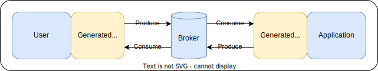

# AsyncAPI Codegen

An AsyncAPI Golang Code generator that generates all Go code from the broker
to the application/user. Just plug your application to your favorite message broker!



**⚠️ We do our best to progressively satisfy the entire AsyncAPI specification,**
**but some features may still be missing: please raise an issue on any bug or**
**missing feature.**

**❤️ Support is greatly appreciated and contributions are welcomed!**

*Inspired from popular [deepmap/oapi-codegen](https://github.com/deepmap/oapi-codegen)*

## Contents

* [Supported functionalities](#supported-functionalities)
* [Usage](#usage)
* [Concepts](#concepts)
* [Examples](#examples)
* [Supported Brokers](#supported-brokers)
  * [Kafka](#kafka)
  * [NATS](#nats) / [NATS JetStream](#nats-jetstream)
  * [Custom broker](#custom-broker)
* [CLI options](#cli-options)
* [Advanced topics](#advanced-topics)
  * [Middlewares](#middlewares)
  * [Context](#context)
  * [Logging](#logging)
  * [Versioning](#versioning)
  * [Extensions](#specification-extensions)
  * [ErrorHandler](#errorhandler)
* [Contributing and support](#contributing-and-support)

## Supported functionalities

* AsyncAPI versions:
  * 2.6.0
  * 3.0.0
* Brokers:
  * Kafka
  * NATS / NATS JetStream
  * Custom
* Formats:
  * JSON
* Logging:
  * Elastic Common Schema (JSON)
  * Text (Humand readable)
  * Custom
* Others:
  * Versioning support

## Usage

In order to use this library in your code, please execute the following lines:

```shell
# Install the tool
go install github.com/lerenn/asyncapi-codegen/cmd/asyncapi-codegen@latest

# Generate the code from the asyncapi file
asyncapi-codegen -i ./asyncapi.yaml -p <your-package> -o ./asyncapi.gen.go

# Install dependencies needed by the generated code
go get -u github.com/lerenn/asyncapi-codegen/pkg/extensions
```

You can also specify the generation part by adding a `go generate` instruction
at the beginning of your file:

```golang
//go:generate go run github.com/lerenn/asyncapi-codegen/cmd/asyncapi-codegen@<version> -i ./asyncapi.yaml -p <your-package> -o ./asyncapi.gen.go
```

### Docker image

You can also use the dockerized version of this tool:

```bash
docker run -v .:/code -w /code lerenn/asyncapi-codegen asyncapi-codegen -i ./asyncapi.yaml -p <your-package> -o ./asyncapi.gen.go
```

## Concepts


Let's imagine a message broker centric architecture: you have the application
that you are developing on the right and the potential user(s) on the left.

Being a two directional communication, both of them can communicate to each
other through the broker. They can even communicate with themselves, in case
of multiple users or application replication.

For more information about this, please refere to the [official AsyncAPI
concepts](https://www.asyncapi.com/docs/concepts).

### With Async API generated code


* <span style="color:yellow">Yellow parts</span>: when using the codegen tool,
you will generate the code that will act as an adapter (called **controller**)
between the user, the broker, and the application.
* <span style="color:red">Red parts</span>: you will need to fill these parts
between user, broker and application. These will allow message production and
reception with the generated code.
* <span style="color:orange">Orange parts</span>: these parts will be available
in this repository if you use an already supported broker. However, you can also
use the implement it yourself if the broker is not supported yet.

## Examples

Here is a list of example, from basic to advanced ones.

**Please note that the examples are separated in different subdirectories per broker.**

It is strongly advised to read them in present order, following your AsyncAPI version.

* **HelloWorld**:
  * [AsyncAPI v2](./examples/helloworld/v2/README.md)
  * [AsyncAPI v3](./examples/helloworld/v3/README.md)
* **Ping**:
  * [AsyncAPI v2](./examples/ping/v2/README.md)
  * [AsyncAPI v3](./examples/ping/v3/README.md)

## Supported Brokers

In order to connect your broker to the autogenerated code, you will need to
create a controller that will be used to publish and subscribe to messages.

You can use one of the already supported brokers or implement your own.

### Kafka

In order to use Kafka as a broker, you can use the following code:

```golang
broker, _ := kafka.NewController([]string{"<host>:<port>", /* additional hosts */}, /* options */)
```

Here are the options that you can use with the Kafka controller:

* `WithGroupdID`: specify the group ID that will be used by the controller. If not specified, default queue name (`asyncapi`) will be used.
* `WithPartition`: specify the partition that will be used by the controller. If not specified, default partition (`0`) will be used.
* `WithMaxBytes`: specify the maximum size of a message that will be received. If not specified, default value (`10e6`, meaning `10MB`) will be used.
* `WithLogger`: specify the logger that will be used by the controller. If not specified, a silent logger is used that won't log anything.
* `WithAutoCommit`: specify if the broker should use auto-commit for incoming messages or manual commits. Note that commits are managed by the broker implementation regardless, with manual commits they are executed after the message is complete processed. Subscribers retain the option to manually handle errors via the ErrorHandler, to use mechanisms such as dead letter or retry topics. The default value is `true`

### NATS

In order to use NATS as a broker, you can use the following code:

```golang
// Create the NATS controller
broker, _ := nats.NewController("nats://<host>:<port>")
defer broker.Close()

// Add NATS controller to a new App controller
ctrl, err := NewAppController(broker, /* options */)

//...
```

Here are the options that you can use with the NATS controller:

* `WithLogger`: specify the logger that will be used by the controller. If not specified, a silent logger is used that won't log anything.
* `WithQueueGroup`: specify the queue group that will be used by the controller. If not specified, default queue name (`asyncapi`) will be used.

### NATS JetStream

In order to use NATS JetStream as a broker, you can use the following code:

```golang
// Create the NATS controller
broker, _ := natsjetstream.NewController("nats://<host>:<port>", /* options */)
defer broker.Close()

// Add NATS controller to a new App controller
ctrl, err := NewAppController(broker)

//...
```

It is important to either create/update a stream with `WithStreamConfig` or to use `WithStream` to specify the stream that will be used by the broker.
Consumer for the user controller can be either created/updated with `WithConsumerConfig` or `WithConsumer`.

#### Limitations

* the messages will be ack'd from the consumer even though the subscription was not setup (this will be logged)

### Custom broker

In order to connect your application and your user to your broker, we need to
provide a controller to it. Here is the interface that you need to satisfy:

```go
import(
  "github.com/lerenn/asyncapi-codegen/pkg/extensions"
)

type BrokerController interface {
  // Publish a message to the broker
  Publish(ctx context.Context, channel string, mw extensions.BrokerMessage) error

  // Subscribe to messages from the broker
  Subscribe(ctx context.Context, channel string) (msgs chan extensions.BrokerMessage, stop chan any, err error)
}
```

You can find that there is an `extensions.BrokerMessage` structure that is provided and
that aims to abstract the event broker technology.

By writing your own by satisfying this interface, you will be able to connect
your broker to the generated code.

## CLI options

### Generation parts (`-g`)

The default options for asyncapi-codegen will generate everything; user, application,
and type definitions but you can generate subsets of those via the -generate
flag. It defaults to user,application,types
but you can specify any combination of those.

Here are the universal parts that you can generate:

* `application`: generate the application boilerplate. `application` requires
  the types in the same package to compile.
* `user`: generate the user boilerplate. It, too, requires the types to be
  present in its package.
* `types`: all type definitions for all types in the AsyncAPI spec.
  This will be everything under `#components`, as well as request parameter,
  request body, and response type objects.

### JSON keys conversion (`--convert-keys`)

By default, the generation will use the key specified in the asyncapi codegen.
This is also called the `none` convertion. You can also convert your keys to
`snake`, `camel`, or `kebab`.

#### Example

Given this schema:

```yaml
Payload:
  type: object
  properties:
    This_is a-Property:
      type: string
```

Here are the generated JSON sent, given by the different options:

```json
/* No conversion (none) */
{ "This_is a-Property": "value" }

/* Camel case (camel) */
{ "ThisIsAProperty": "value" }

/* Kebab case (kebab) */
{ "this-is-a-property": "value" }

/* Snale case (snake) */
{ "this_is_a_property": "value" }
```

## Advanced topics

### Middlewares

You can use middlewares that will be executing when receiving and publishing
messages. You can add one or multiple middlewares using the  `WithMiddlewares`
function in the initialization of the App or User controller:

```golang
// Create a new app controller with middlewares
ctrl, _ := NewAppController(/* Broker of your choice */, WithMiddlewares(myMiddleware1, myMiddleware2 /*, ... */))
```

Here the function signature that should be satisfied:

```golang
func(ctx context.Context, msg *extensions.BrokerMessage, next extensions.NextMiddleware) error
```

**Note:** the returned context will be the one that will be passed to following
middlewares, and finally to the generated code (and subscription callback).

#### Examples

##### Filtering messages

```golang
import(
  "github.com/lerenn/asyncapi-codegen/pkg/extensions"
  // ...
)

func myMiddleware(ctx context.Context, _ *extensions.BrokerMessage, _ middleware.Next) error {
  // Execute this middleware only if this is a received message
  extensions.IfContextValueEquals(ctx, extensions.ContextKeyIsDirection, "reception", func() {
    // Do specific stuff if message is received
  })

  return nil
}
```

You can even discriminate on more specification. Please see the [Context section](#context).

##### Modify messages before sending/receiving

```golang
import(
  "github.com/lerenn/asyncapi-codegen/pkg/extensions"
  // ...
)

func myMiddleware(_ context.Context, msg *extensions.BrokerMessage, _ middleware.Next) error {
  msg.Headers["additional"] = "some-info"
  return nil
}
```

##### Stopping message processing

```golang
import(
  "github.com/lerenn/asyncapi-codegen/pkg/extensions"
  // ...
)

func myMiddleware(_ context.Context, msg *extensions.BrokerMessage, _ middleware.Next) error {
  if msg.Headers["author"] != "me" {
    return fmt.Errorf("this is not me, aborting...")
  }
  return nil
}
```

#### Executing code after receiving/publishing the message

By default, middlewares will be executed right before the operation. If there is
a need to execute code before and/or after the operation, you can call the `next`
argument that represents the next middleware that should be executed or the
operation corresponding code if this was the last middleware.

Here is an example:

```golang
import(
  "github.com/lerenn/asyncapi-codegen/pkg/extensions"
  // ...
)

func surroundingMiddleware(ctx context.Context, next extensions.NextMiddleware) error {
  // Pre-operation
  fmt.Println("This will be displayed BEFORE the reception/publication")

  // Calling next middleware or reception/publication code
  // The given context will be the one propagated to other middlewares and operation source code
  err := next(ctx)

  // Post-operation
  fmt.Println("This will be displayed AFTER the reception/publication")

  return err
}
```

### Context

When receiving the context from generated code (either in subscription,
middleware, logging, etc), you can get some information embedded in context.

To get these information, please use the functions from
`github.com/lerenn/asyncapi-codegen/pkg/extensions`:

```golang
// Execute this middleware only if this is from "ping" channel
extensions.IfContextValueEquals(ctx, extensions.ContextKeyIsChannel, "ping", func() {
  // Do specific stuff if the channel is ping
})
```

You can find other keys in the package `pkg/extensions`.

### Logging

You can have 2 types of logging:
* **Controller logging**: logs the internal operations of the controller (subscription, malformed messages, etc);
* **Publication/Reception logging**: logs every publication or reception of messages.

#### Controller logging

To log internal operation of the controller, the only thing you have to do is
to initialize the controller with a logger, with the function `WithLogger()`:

```golang
import(
  "github.com/lerenn/asyncapi-codegen/pkg/extensions/brokers"
  // ...
)

func main() {
  // Create a new app controller with an Elastic Common Schema JSON compatible logger
  ctrl, _ := NewAppController(/* Broker of your choice */, WithLogger(log.NewECS()))

  // ...
}
```

You can find all loggers in the directory `pkg/log`.

#### Publication/Reception logging

To log published and received messages, you'll have to pass a logger as a middleware
in order to execute it on every published and received messages:

```golang
import(
  "github.com/lerenn/asyncapi-codegen/pkg/extensions/brokers"
  // ...
)

func main() {
  // Create a new app controller with a middleware for logging incoming/outgoing messages
  loggingMiddleware := middleware.Logging(log.NewECS())
  ctrl, _ := NewAppController(/* Broker of your choice */, WithMiddlewares(loggingMiddleware))

  // ...
}
```

#### Custom logging

It is possible to set your own logger to the generated code, all you have to do
is to fill the following interface:

```golang
type Logger interface {
    // Info logs information based on a message and key-value elements
    Info(ctx log.Context, msg string, info ...log.AdditionalInfo)

    // Error logs error based on a message and key-value elements
    Error(ctx log.Context, msg string, info ...log.AdditionalInfo)
}
```

Here is a basic implementation example:

```golang
type SimpleLogger struct{}

func (logger SimpleLogger) formatLog(ctx log.Context, info ...log.AdditionalInfo) string {
  var formattedLogInfo string
  for i := 0; i < len(keyvals)-1; i += 2 {
    formattedLogInfo = fmt.Sprintf("%s, %s: %+v", formattedLogInfo, info.Key, info.Value)
  }
  return fmt.Sprintf("%s, context: %+v", formattedLogInfo, ctx)
}

func (logger SimpleLogger) Info(ctx log.Context, msg string, info ...log.AdditionalInfo) {
  log.Printf("INFO: %s%s", msg, logger.formatLog(ctx, info...))
}

func (logger SimpleLogger) Error(ctx log.Context, msg string, info ...log.AdditionalInfo) {
  log.Printf("ERROR: %s%s", msg, logger.formatLog(ctx, info...))
}
```

You can then create a controller with a logger using similar lines:

```golang
// Create a new app controller with the custom logger
ctrl, _ := NewAppController(
  /* Broker of your choice */,
  WithLogger(SimpleLogger{}),                         /* Use on as internal logger */
  WithMiddleware(middleware.Logging(SimpleLogger{})), /* Use to log incoming/outgoing messages */
)
```

### Versioning

If you are in need to do a migration or support multiple versions of your
AsyncAPI specifications, you can use the `versioning` package:

```golang

import (
  "github.com/lerenn/asyncapi-codegen/pkg/extensions/brokers/nats"
  "github.com/lerenn/asyncapi-codegen/pkg/extensions/versioning"
  v1 "path/to/asyncapi/spec/version/1"
  v2 "path/to/asyncapi/spec/version/2"
)

func main() {
  // Create a broker (here from NATS)
  broker, _ := nats.NewController("nats://nats:4222"))
  defer broker.Close()

  // Add a version wrapper to the broker
  vw := versioning.NewWrapper(broker)

  // Create application for version 1
  appV1, _ := v1.NewAppController(vw, /* controller options */)
  defer appV1.Close(context.Background())

  // Create v2 app
  appV2, _ := v2.NewAppController(vw, /* controller options */)
  defer appV2.Close(context.Background())

  // ...
}
```

Then you can use each application independently:

```golang
err := appV1.SubscribeHello(context.Background(), func(ctx context.Context, msg v1.HelloMessage) {
  // Stuff for version 1
})

err := appV2.SubscribeHello(context.Background(), func(ctx context.Context, msg v2.HelloMessage) {
  // Stuff for version 2
})
```

That way, you can support multiple different versions with the same broker.

#### Version tagging

The versioning feature will add an `application-version` header to each
message in order to have the correct version of the application on each of
them.

##### Non-tagged messages

If messages can have no `application-version`, you can use the option `WithDefaultVersion`
to add a default version to non-tagged messages.

```golang
vw := versioning.NewWrapper(broker, versioning.WithDefaultVersion("1.1.4"))
```

##### Change header key for application version

Also, if you don't want to use this header as a recipient to the application version,
you can specify your own header with the option `WithVersionHeaderKey`.

```golang
vw := versioning.NewWrapper(broker, versioning.WithVersionHeaderKey("my-version-key"))
```

#### Knowing generated version

If you want to use the version of the AsyncAPI document used, you can access the constant
`AsyncAPIVersion` that is generated with the types. It is generated as followed:

```go
const AsyncAPIVersion = "{{ .Info.Version }}"
```

### Specification extensions

#### Schema Object extensions

These extension properties apply to "Schema Objects" in AsyncAPI spec.

* `x-go-type`: Overrides the default Go type with the specified Go type name.

  For example,

  ```yaml
  schemas:
    Object:
      properties:
        flag:
          type: integer
          x-go-type: uint8
  ```

  will be generated as

  ```go
  type Object struct {
          Flag uint8 `json:"flag"`
  }
  ```

* `x-go-type-import`: Specifies the import package for `x-go-type`.
                      This has two properties `name` and `path`.
        `path` is the package import path, e.g. `github.com/google/uuid`.
        `name` is the package import name, which is optional.
  For example,

  ```yaml
  schemas:
    Object:
      properties:
        flag:
          type: integer
          x-go-type: mypackage.Flag
          x-go-type-import:
            path: abc.xyz/repo/mypackage
  ```

  will be generated as

  ```go
  import (
          "abc.xyz/repo/mypackage"
  )

  // ...

  type Object struct {
          Flag mypackage.Flag `json:"flag"`
  }
  ```

  while

  ```yaml
  schemas:
    Object:
      properties:
        flag:
          type: integer
          x-go-type: alias.Flag
          x-go-type-import:
            path: abc.xyz/repo/mypackage
            name: alias
  ```

  will be generated as

  ```go
  import (
          alias "abc.xyz/repo/mypackage"
  )

  // ...

  type Object struct {
          Flag alias.Flag `json:"flag"`
  }
  ```

### ErrorHandler

You can use an error handler that will be executed when processing for messages
failed. To add a custom ErrorHandler to your controller use the  `WithErrorHandler`
function in the initialization of the App or User controller:

```golang
// Create a new app controller with ErrorHandler
ctrl, _ := NewAppController(/* Broker of your choice */, WithErrorHandler(myErrorHandler), ...)
```

Here the function signature that should be satisfied:

```golang
func(ctx context.Context, topic string, msg *AcknowledgeableBrokerMessage, err error)
```

**Note:** The default ErrorHandler is a Noop ErrorHandler doing nothing. By using a ErrorHandler you can add custom behavior for example to move messages to retry or dead letter topics/queues. 
Acks and Naks will be executed after the ErrorHandler, you can use the AcknowledgeableBrokerMessage in the handler to Ack/Nak the message manually.

#### Examples

##### Use the Logging ErrorHandler
```golang
// Create a new app controller with Logging ErrorHandler
ctrl, _ := NewAppController(/* Broker of your choice */, WithErrorHandler(errorhandlers.Logging(mylogger)), ...)
```

##### Build a custom ErrorHandler and handle Ack/Nak of the message
```golang
func(ctx context.Context, topic string, msg *extensions.AcknowledgeableBrokerMessage, err error) {
    // check error or move message to some other queue/topic
    handleTheErrorSomehow()
    
    // Ack or Nak the message
    msg.Ack()
    msg.Nak()
}
```

## Contributing and support

If you find any bug or lacking a feature, please raise an issue on the Github repository!

Also please do not hesitate to propose any improvment or bug fix on PR.
Any contribution is warmly welcomed!

And if you find this project useful, please support it through the Support feature
on Github.
