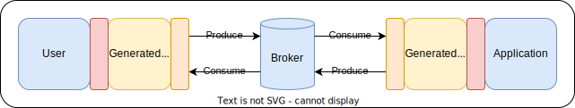

# AsyncAPI Client and Server Code Generator

Generate Go client and server boilerplate from AsyncAPI specifications.

**Important: Do not hesitate to contribute or raise on issue on any bug or missing feature.**

*Inspired from popular [deepmap/oapi-codegen](https://github.com/deepmap/oapi-codegen)*

## Contents

* [Supported functionalities](#supported-functionalities)
* [Concepts](#concepts)
* [Examples](#examples):
  * [Basic example](#basic-example)
  * [Request/Response example](#request-response-example)
* [CLI options](#cli-options)
* [Contributing and support](#contributing-and-support)

## Supported functionalities

* AsyncAPI versions:
  * 2.6.0
* Brokers:
  * NATS
  * Custom (implementation specified by the developer)
* Formats:
  * JSON

## Concepts


Let's imagine a message broker centric architecture: you have the application
that you are developing on the right and the potential client(s) on the left.

Being a two directional communication, both of them can communicate to each
other through the broker. They can even communicate with themselves, in case
of multiple clients or application replication.

For more information about this, please refere to the [official AsyncAPI
concepts](https://www.asyncapi.com/docs/concepts).

### With Async API generated code



* <span style="color:yellow">Yellow parts</span>: when using the codegen tool,
you will generate the code that will act as an adapter (or controller) between
the client, the broker, and the application.
* <span style="color:red">Red parts</span>: you will need to fill these parts
between client, broker and application. These will allow message production and
reception with the generated code.
* <span style="color:orange">Orange parts</span>: these will be also generated
automatically if you use an implemented message broker. You can also use the
`none` type in order to implement it yourself.

## Examples

Here is a list of example, from basic to advanced ones.

### Basic example

This example will use the AsyncAPI official example of the
[HelloWorld](https://www.asyncapi.com/docs/tutorials/getting-started/hello-world).

> The code for this example have already been generated and can be
[read here](./examples/helloworld/), in the subdirectories `app/generated/`
and `client/generated/`. You can execute the example with `docker-compose up`.

In order to recreate the code for client and application, you have to run this command:

```shell
# Install the tool
go install github.com/lerenn/asyncapi-codegen/cmd/asyncapi-codegen@latest

# Generate the code from the asyncapi file
asyncapi-codegen -i examples/helloworld/asyncapi.yaml -o ./helloworld.gen.go
```

We can then go through the `helloworld.gen.go` file to understand what will be used.

#### Application

Here is the code that is generated for the application side, with corresponding
comments:

```go
// AppController is the struct that you will need in order to interact with the
// event broker from the application side. You will generate this with the 
// NewAppController function below.
type AppController struct

// NewAppController will create a new App Controller and will connect the
// BrokerController that you pass in argument to subscription and publication method.
func NewAppController(bs BrokerController) *AppController

// SubscribeAll will subscribe to all channel that the application should listen to.
//
// In order to use it, you'll have to implement the AppSubscriber interface and 
// pass it as an argument to this function. Thus, the subscription will automatically
// call the corresponding function when it will receive a message.
//
// In the HelloWorld example, only one function will listen on application side,
// making it a bit overkill. You can directly use the SubscribeHello method.
func (ac *AppController) SubscribeAll(as AppSubscriber) error

// UnsubscribeAll will unsubscribe all channel that have subscribed to through
// SubscribeAll or SubscribeXXX where XXX correspond to the channel name.
func (ac *AppController) UnsubscribeAll()

// Close function will clean up all resources and subscriptions left in the
// application controller. This should be call right after NewAppController
// with a `defer`
func (ac *AppController) Close()

// SubscribeHello will subscribe to new messages on the "hello" channel.
// It will expect messages as specified in the AsyncAPI specification.
//
// You just have to give a function that match the signature of the callback and
// then process the received message.
func (ac *AppController) SubscribeHello(fn func(msg HelloMessage)) error

// UnsubscribeHello will unsubscribe only the subscription on the "hello" channel.
// It should be only used when wanting specifically that, otherwise the clean up
// will be handled by the Close function.
func (ac *AppController) UnsubscribeHello()

// Listen will wait on the irq channel given in paramter.
// Thus you will be able to listen to new messages on subscribed channels, and
// interrupt the listening if you want by sending anything on the IRQ channel.
func (ac *AppController) Listen(irq chan interface{})
```

And here is an example of the application that could be written to use this generated
code with NATS (you can also find it [here](./examples/helloworld/app/main.go)):

```go
// Connect to NATS
nc, _ := nats.Connect("nats://nats:4222")

// Create a new application controller
ctrl := generated.NewAppController(generated.NewNATSController(nc))
defer ctrl.Close()

// Subscribe to HelloWorld messages
log.Println("Subscribe to hello world...")
ctrl.SubscribeHello(func(msg generated.HelloMessage) {
  log.Println("Received message:", msg.Payload)
})

// Listen to new messages
log.Println("Listening to subscriptions...")
irq := make(chan interface{})
ctrl.Listen(irq)
```

#### Client

Here is the code that is generated for the client side, with corresponding
comments:

```go
// ClientController is the struct that you will need in order to interact with the
// event broker from the client side. You will generate this with the 
// NewClientController function below.
type ClientController struct

// NewClientController will create a new Client Controller and will connect the
// BrokerController that you pass in argument to subscription and publication method.
func NewClientController(bs BrokerController) *ClientController

// PublishHello will publish a hello world message on the "hello" channel as
// specified in the AsyncAPI specification.
func (cc *ClientController) PublishHello(msg HelloMessage) error
```

And here is an example of the client that could be written to use this generated
code with NATS (you can also find it [here](./examples/helloworld/app/main.go)):

```go
// Connect to NATS
nc, _ := nats.Connect("nats://nats:4222")

// Create a new application controller
ctrl := generated.NewClientController(generated.NewNATSController(nc))
defer ctrl.Close()

// Send HelloWorld
log.Println("Publishing 'hello world' message")
ctrl.PublishHello(generated.HelloMessage{Payload: "HelloWorld!"})
```

#### Types

According to the specification that you pass in parameter, some types will also
be generated. Here is the ones generated for the HelloWorld example:

```go
// HelloMessage will contain all the information that will be sent on the 'hello'
// channel. There is only a payload here, but you could find also headers,
// correlation id, and more.
type HelloMessage struct {
	Payload string
}
```

#### Broker

In order to connect your application and your client to your broker, we need to
provide an adapter to it. Here is the interface that you need to satisfy:

```go
type BrokerController interface {
  // Publish will be called under the hood by any PublishXXX function
	Publish(channel string, mw UniversalMessage) error
  // Subscribe will be called under the hood by any SubscribeXXX function
	Subscribe(channel string) (msgs chan UniversalMessage, stop chan interface{}, err error)
}
```

You can find that there is an `UniversalMessage` structure that is provided and
that aims to abstract the event broker technology.

You can either generate an already existing adapter, or write your own if it doesn't
exists or if it doesn't suit your needs.

### Request/Response example

This example will use a `ping` example that you can find 
[here](./examples/ping/asyncapi.yaml).

> The code for this example have already been generated and can be
[read here](./examples/ping/), in the subdirectories `server/generated/`
and `client/generated/`. You can execute the example with `docker-compose up`.

In order to recreate the code for client and application, you have to run this command:

```shell
# Install the tool
go install github.com/lerenn/asyncapi-codegen/cmd/asyncapi-codegen@latest

# Generate the code from the asyncapi file
asyncapi-codegen -i examples/ping/asyncapi.yaml -o ./ping.gen.go
```

We can then go through the possible application and client implementations that
use `ping.gen.go`. 

#### Application (or server in this case)

```golang
type ServerSubscriber struct {
	Controller *generated.AppController
}

func (s ServerSubscriber) Ping(req generated.PingMessage) {
	// Generate a pong message, with the same correlation Id
	resp := generated.NewPongMessage()
	resp.Payload = "pong"
	resp.Headers.CorrelationID = req.Headers.CorrelationID

	// Publish the pong message
	err := s.Controller.PublishPong(resp)
	if err != nil { /* ...*/ }
}

func main() {
	/* ... */

	// Create a new server controller
	ctrl := generated.NewAppController(generated.NewNATSController(nc))

	// Subscribe to all (we could also have just listened on the ping request channel)
	sub := ServerSubscriber{Controller: ctrl}
	if err := ctrl.SubscribeAll(sub); err != nil { /* ... */	}

	// Listen to new messages
	irq := make(chan interface{})
	ctrl.Listen(irq)
}
```

#### Client

```golang
// Create a new client controller
ctrl := generated.NewClientController(/* Add corresponding broker controller */)

// Make a new ping message
req := generated.NewPingMessage()
req.Payload = "ping"

// Create the publication function to send the message
publicationFunc := func() error {
  return ctrl.PublishPing(req)
}

// The following function will subscribe to the 'pong' channel, execute the publication
// function and wait for a response. The response will be detected through its
// correlation ID.
// 
// This function is available only if the 'correlationId' field has been filled
// for any channel in the AsyncAPI specification. You will then be able to use it
// with the form WaitForXXX where XXX is the channel name.
resp, err := ctrl.WaitForPong(req.Headers.CorrelationID, publicationFunc, time.Second)
if err != nil {
  panic(err)
}
```

## CLI options

The default options for oapi-codegen will generate everything; client, application,
broker, type definitions, and broker implementations but you can generate subsets
of those via the -generate flag. It defaults to client,application,broker,types
but you can specify any combination of those.

Here are the universal parts that you can generate:

* `application`: generate the application boilerplate. `application` requires
  the types in the same package to compile.
* `client`: generate the client boilerplate. It, too, requires the types to be
  present in its package.
* `broker`: generate the broker controller that you have to fill either with an
  existing implementation (more below), or by implementing your own.
* `types`: all type definitions for all types in the AsyncAPI spec.
  This will be everything under `#components`, as well as request parameter,
  request body, and response type objects.

You can also specify some specific implementation for the broker of your choice:

* `nats`: generate the NATS message broker boilerplate.

## Contributing and support

If you find any bug or lacking a feature, please raise an issue on the Github repository!

Also please do not hesitate to propose any improvment or bug fix on PR.
Any contribution is warmly welcomed!

And if you find this project useful, please support it through the Support feature
on Github.
